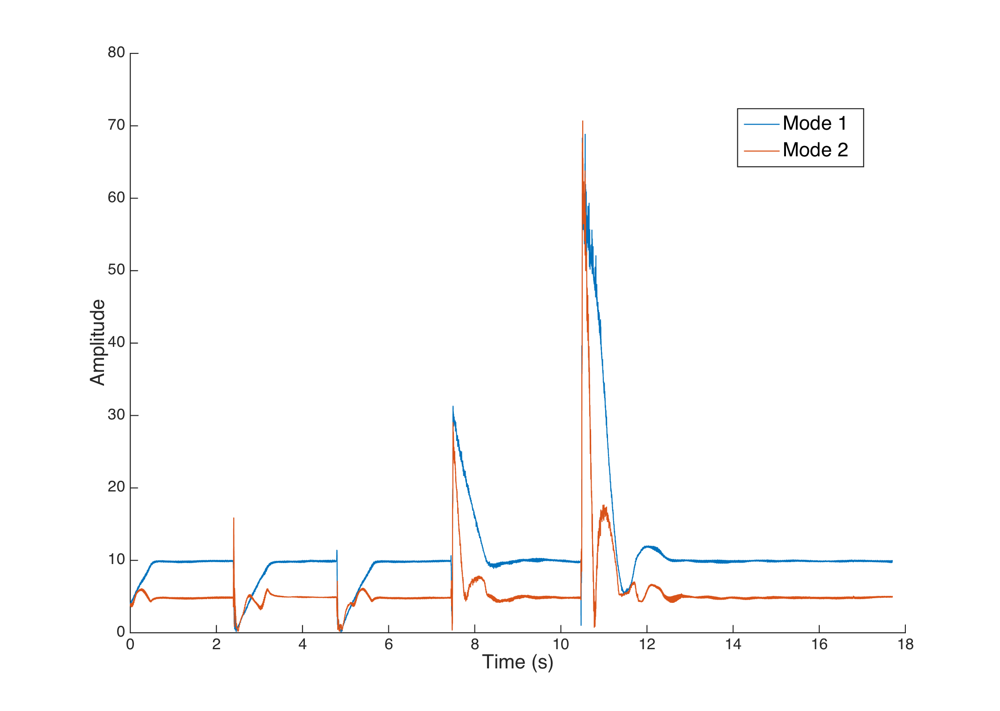
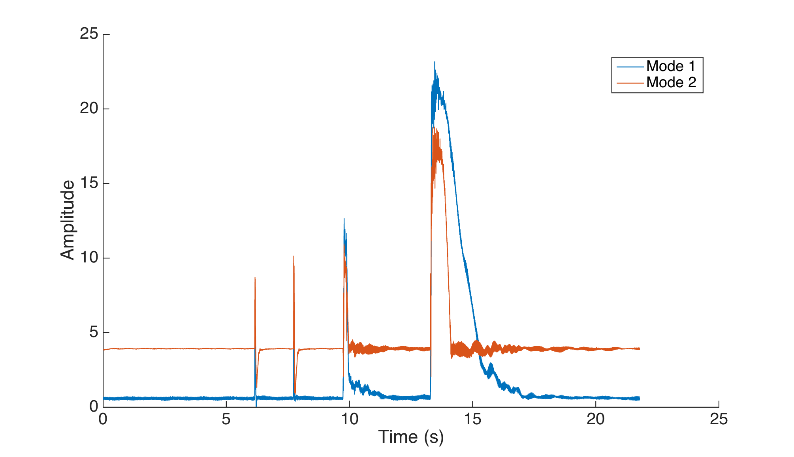
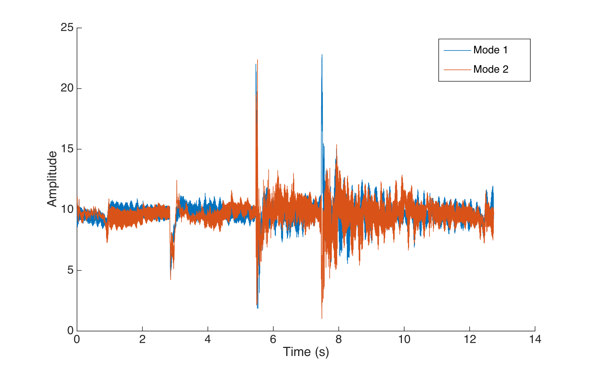

# Controlling the timbre

## The phase lock system

The output signal sent to the current-output amplifier is a sum of sine waves which amplitudes vary to damp or increase each modal amplitude. To sync the phase for each mode, we simply used the output phase of the Fourier coefficient algorithm described in [the state-sensor algorithm page](/state_sensor_algorithm).

An important consequence of the assumption we made earlier that all the waves are standing waves is that there is no phase shift between the signal seen at the end and at the middle of the string : there can be a difference of amplitude and a change of sign (ruled by the term $\sin(n\pi x_0/L)$)  but the signal is the same everywhere.

When the predefined frequency of analysis $\omega_0$ does not exactly match the actual frequency of the string $\omega$, the output of the state sensor-algorithm outputs $\phi(t)$  so that $\sin\left(\omega_0t + \phi(t)\right) = \sin(\omega t + \psi)$. This property insured us that we would always drive the system at the right frequency.

However robust, the output $\phi(t)$ was still noisy and we chose to filter the driving signals $\sin\left(\omega_{0,n}t + \phi_n(t)\right)$, with a moving average.

A moving average is a very simple case of an IIR filter (Infinite Impulse Response). Though not optimal in its filtering properties, it is very inexpensive to compute. Because of the high sampling frequency and the low frequency of interest, biquad filters were not used here.

## The code architecture

In the complete script we first declare all the arrays that we will need for the moving averages and for data logging (arrays are filled with the values before being written only at the very end of the script). We also initialiase all log files, with defining information (such as the tested targets), and we pre-calculate the exponential and store it in a lookup table.

The core of the processing is inside the `render` function of the Bela environment. It loops for each new sample coming from the ADC. We first update the values of the state-sensor algorithm, for each mode. The below code blocks only show one mode for clarity :

```cpp
exponentialTimesSamples_M1_R_Sum -= exponentialTimesSamples_M1_R[sampleIndex];
exponentialTimesSamples_M1_I_Sum -= exponentialTimesSamples_M1_I[sampleIndex];

latestSample = audioRead(context, n, 0);

exponentialTimesSamples_M1_R[sampleIndex] = latestSample*COMPLEX_EXPONENTIAL_TABLE_M1_R[sampleIndex];
exponentialTimesSamples_M1_I[sampleIndex] = latestSample*COMPLEX_EXPONENTIAL_TABLE_M1_I[sampleIndex];

exponentialTimesSamples_M1_R_Sum += exponentialTimesSamples_M1_R[sampleIndex];
exponentialTimesSamples_M1_I_Sum += exponentialTimesSamples_M1_I[sampleIndex];

amplitude_squared_M1 = (exponentialTimesSamples_M1_R_Sum*exponentialTimesSamples_M1_R_Sum + exponentialTimesSamples_M1_I_Sum*exponentialTimesSamples_M1_I_Sum)*ONE_OVER_NUMBER_OF_SAMPLES_SQUARED;

phase_M1 =  (amplitude_squared_M1>0.1) ? atan2(exponentialTimesSamples_M1_I_Sum,exponentialTimesSamples_M1_R_Sum) : 0;
// The Phase is set to zero when the amplitude is too low, as the result would be unpredictable


sampleIndex = (sampleIndex + 1)%NUMBER_OF_SAMPLES;
```


We then calculate the driving signal by smoothing the synced sine with a moving average, compensating for the induced phase shift.

```cpp
phaseAverageSum_M1 -= phaseAverageArray_M1[averagingPhasesIndex];
phaseAverageArray_M1[averagingPhasesIndex] = sin(sampleIndex*PHASE_INCREMENT_M1 - PI/2 + phase_M1);
phaseAverageSum_M1 += sin(sampleIndex*PHASE_INCREMENT_M1 - PI/2 + phase_M1 + PHASE_OFFSET_M1);

averagingPhasesIndex = (averagingPhasesIndex+1)%NUMBER_OF_AVERAGING_PHASES;
```

The phase shift is easy to calculate : 

```cpp
const float PHASE_OFFSET_M1 = (PHASE_INCREMENT_M1*NUMBER_OF_AVERAGING_PHASES)/2.0;
```


Just like for the phase, we also smooth the detected amplitude with a moving average : 

```cpp
amplitudeAverageSum_M1 -= amplitudeAverageArray_M1[averagingAmplitudesIndex];
amplitudeAverageArray_M1[averagingAmplitudesIndex] = sqrt(amplitude_squared_M1);
amplitudeAverageSum_M1 += amplitudeAverageArray_M1[averagingAmplitudesIndex];

averagingAmplitudesIndex = (averagingAmplitudesIndex+1)%NUMBER_OF_AVERAGING_AMPLITUDES;

```


Then, we calculate the gain factor for the driving signal. Here we use a proportional control, and the target has been set in advance. Knowing that the DAC of the Bela will saturate for values above `1`, we also restrict the amplitude of the output signal to safe values, to avoid saturation.

```cpp
gain_M1 = PROPORTIONAL_GAIN_M1*(target_M1 - (amplitudeAverageSum_M1*ONE_OVER_NUMBER_OF_AVERAGING_AMPLITUDES));
gain_M1 = (abs(gain_M1) > 1) ? ((0 < gain_M1) - (gain_M1 < 0))*1 : gain_M1;
// Which means :
//			|  -1 		if gain_M1<-1
//gain_M1 = |  +1 		if gain_M1>1
//			|  gain_M1 	overwise
```


We can now compute the output value, and send it to the ADC

```cpp
outputCommand =    gain_M1 * drivingSyncedSine_M1
  				+  gain_M2 * drivingSyncedSine_M2
  				+  gain_M3 * drivingSyncedSine_M3
  				+  gain_M4 * drivingSyncedSine_M4
  				+  gain_M5 * drivingSyncedSine_M5
  				;


audioWrite(context, n, 0, outputCommand); // Left Channel
audioWrite(context, n, 1, outputCommand); // Right Channel

```


At the end of the loop, we log the values of interest at different frequencies : 

- The sensor input and command ouput are logged at $44.1\text{kHz}$
- The slowly changing components such as amplitudes, phase-shifts, gains, are only logged at $441\text{Hz}$, to save disk space

The `cleanup` routine then flushes all buffers into their corresponding files.

### Optimizations

A few simple optimizations have been used to increase the speed of the system : 

- All numbers are represented as `float`s taking advantage of hardware accelerations
- The above code blocks use standard `C++` functions for calculating sines (for clarity), square roots and absolute values, while the actual code uses [fast math functions](https://github.com/BelaPlatform/Bela/wiki/Fast-math-functions ) that also rely on the hardware of the BeagleBone.

>  We also want to implement other ideas, which first need to be tested : 
>
>  - All averaging arrays could have a fixed length of 64 or 32 and could merged into one array that would use bitwise operations to separate the values. This would allow the array to be stored in cache and not RAM for faster processing.
>  - We could use auxiliary functions to refresh the state vector instead of putting all the calculations in the main thread. This would ensure no audio frame can be missed, while still enabling fast control. Only the driving signal would be computed in the main thread.
>  - We could try to remove the lookup table for the exponential signal and just calculate its value using the optimized functions

## Proportional control

We can finally apply the proposed control to the system.

We initially tried to maintain a fixed amplitude position for the first and second modes. The system is stable, though slow. 



The sudden changes in amplitude are caused by us stopping the vibration or hitting the string with a plectrum.

Here is the audio recording of the test : 

<audio controls><source src="media/SmoothedControl__TAR_M1_10__TAR_M2_5.ogg" type="audio/ogg"><source src="media/SmoothedControl__TAR_M1_10__TAR_M2_5.mp3" type="audio/mp3"></audio>

The same experiment, with a different, smaller target : 

<audio controls><source src="media/SmoothedControl__TAR_M1_0.6__TAR_M2_4.ogg" type="audio/ogg"><source src="media/SmoothedControl__TAR_M1_0.6__TAR_M2_4.mp3" type="audio/mp3"></audio>


The limiting factor was the saturation limit of the Bela DAC, as the current-output amplifier needed a large analog gain. This stopped us from digitally adding a more aggressive gain.

We added a preamplifier stage to the current-output to overcome this issue.

The added gain made the system much more responsive but also (predictably) more unstable.



The audio for this experiment : 

<audio controls><source src="media/SmoothedControl__TAR_M1_10__TAR_M2_10_new.ogg" type="audio/ogg"><source src="media/SmoothedControl__TAR_M1_10__TAR_M2_10_new.mp3" type="audio/mp3"></audio>

Adding a derivative term to the control should stop this oscillation.

This is unfortunately (and frustratingly) the last control experiment we had the time to conduct before writing this report.


However, we tried, as a proof of concept, to use the results of the magnetic scans to linearise the effect of the actuators in [the next page](/linearising).